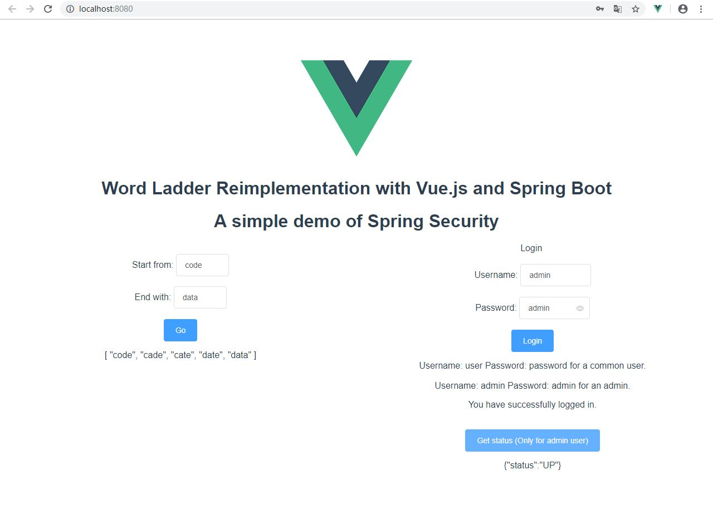

# SE418-Homework

## Homework 1

A naive Word Ladder application, using RESTful API.

## Task 1

* Analyze the home page loading of SJTU
    
    * Compare with other website homepage
    * Carry out your optimation solution 

## Homework2

A simple Word Ladder application, using RESTful API.

This is NOT a replica of Homework 1, because there are a lot of improvements, including:

* Add white box tests for a few classes. (Phase I)
* Fix the bug "File not found" when starting the service with a packaged jar file. (Phase I)
* Test reports are available. (Phase I)
* Fix a bug in the front end. (Phase I)
* Enable Spring Boot Actuator. (Phase II)
* Add tests for Spring Boot Actuator. (Phase II)
* Enable Spring Security and integrate frontend and backend. (Phase II)

## Task 2

* Analyze the resource comsumption of the Word Ladder application
    
    * Prometheus Usage
    * Jmeter Usage
    * Java VisualVM Usage

## Task 3

* Containerize a Spring Boot Application

    * Docker Usage