# Analyze the home page loading of SJTU

用浏览器开发者工具分析[**交大主页**](https://www.sjtu.edu.cn/)的载入过程。

## Chrome Devtools 简介

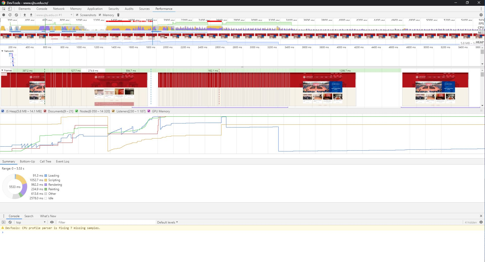

Chrome应该是最适合开发者的一款浏览器了，一是因为它对web标准的支持以及比较好的性能，二是因为它的开发者工具比其他浏览器不知道高到哪里去了，其中有很多选项卡我之前还没有用到过，正好借这次作业的机会我可以进一步了解一下Chrome开发者工具的强大功能。

## Performance选项卡

分析交大主页的载入过程主要可以用开发者选项的Performance选项卡来进行。

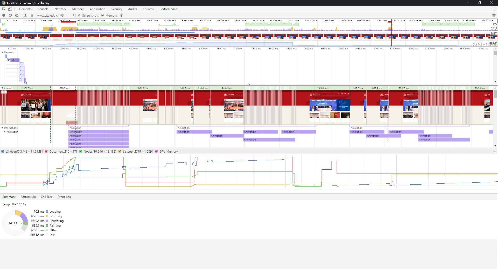

可以看到从开始加载到Chrome认为页面稳定一共花了14113毫秒。其中有8秒左右是空闲的，应该是浏览器在等待新闻的自动翻页。

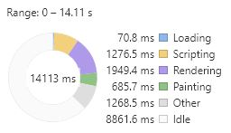

可以看到大部分事件都花在加载脚本和渲染上面，毕竟交大官网的动画比较多，这些都需要JavaScript的实现。

在函数调用的统计方面，最大的函数调用开销是这个init的函数，这个函数定义在main.js里面，是开发者写的（不是库里面的）。

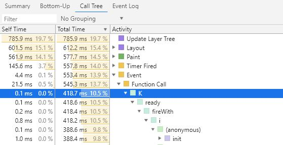

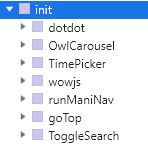

看样子里面应该初始化了一些页面上的状态。

作为对比，我对bilibili的首页也做了一次profile，结果如下图所示。

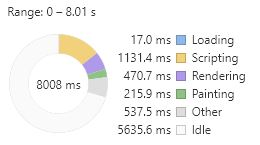

bilibili首页的加载快在什么地方呢？我觉得有如下的两个原因：

* 图片懒加载：

    bilibili的首页只有当用户向下滚动的时候才会主动再去加载页面下部的图片，而不是在载入的时候一下子全部下载完。

* 缩略图优化：

    bilibili首页上面的小图的分辨率惨不忍睹，一般是260\*150或者160\*100之类的尺寸，但是由于显示的大小也很小所以对用户的体验基本没有影响。同时又有[***webp***](https://en.wikipedia.org/wiki/WebP)技术的加持，缩小了图片的体积。

    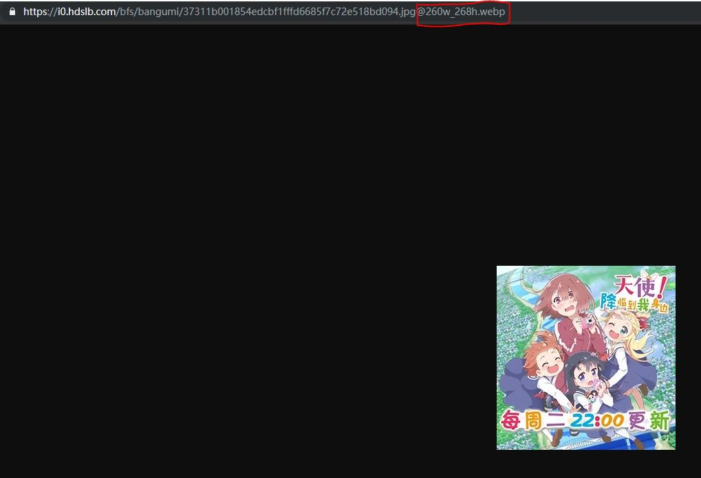 

## Network选项卡

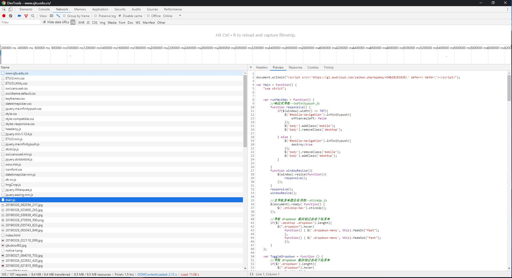

这个选项卡里面主要是记录了浏览器向后端请求资源的过程。

交大首页加载的时候network选项卡里面主要是图片、JavaScript脚本、css和html，同时还有两个json文件。

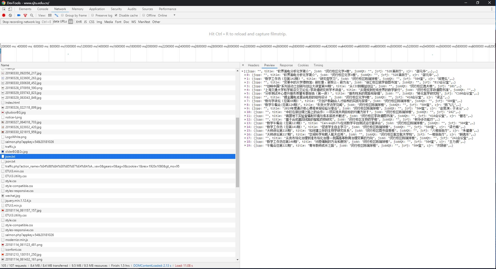

单从这个json对应的前端组件上来说，这是应用了前后端分离的**MVVM**模式（现在比较流行）。

作为对比，bilibili就大量运用的**MVVM**设计模式，实现了前后端的分离。也间接提高了首页的加载速度。

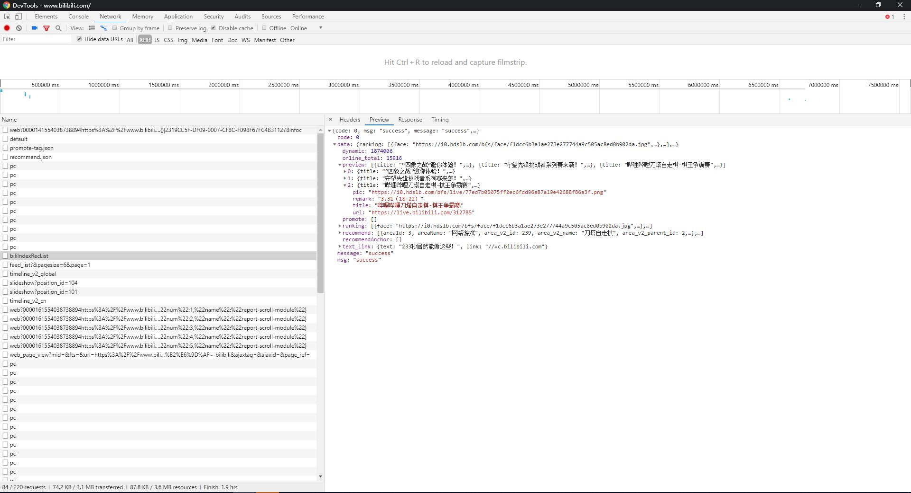

## 总结

交大的首页有哪里可以改进呢？我认为有以下几点：

* 实现图片的懒加载
* 实现缩略图机制
* 可以迁移到**MVVM**设计模式（这个对首页加载速度的贡献可能不大，但统一设计一个RESTful API可以实现前后端分离。开发别的应用的时候也能使用这个API。）

## 其他有趣的选项卡

### Elements选项卡

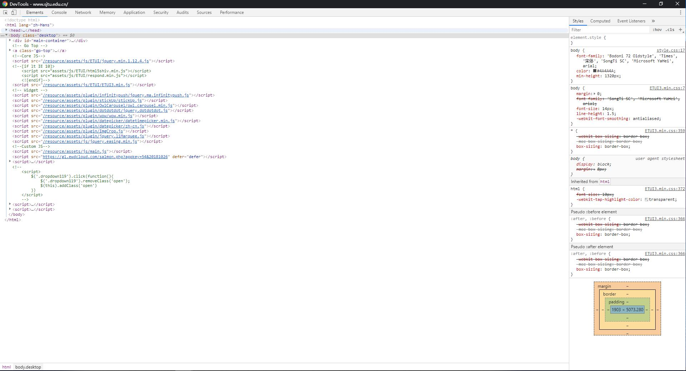

Elements选项卡里面主要是显示当前页面上面各个元素的代码和样式（还有DOM断点和事件监听列表）。如果网页是由JavaScript动态生成的话该选项卡里面的内容也会响应式地变化。右侧的样式也是响应式地变化，开发者也可以自行增删改查样式属性。这些功能在Debug时比较有用。

### Console选项卡

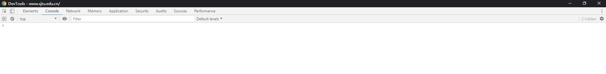

JavaScript的控制台，console.log()的内容都能在这里显示,在开发的时候也很有用。
