# Task 2

分析Word Ladder应用的资源消耗情况。

测试平台：

CPU: AMD Ryzen 5 1600 (6 cores, 12 threads)

Memory: DDR4 8G 2400 MHz

Video Card: RX580 8G

Word Ladder的单词数为221922个。

## 空载时的资源消耗情况

### Java VisualVM 工具
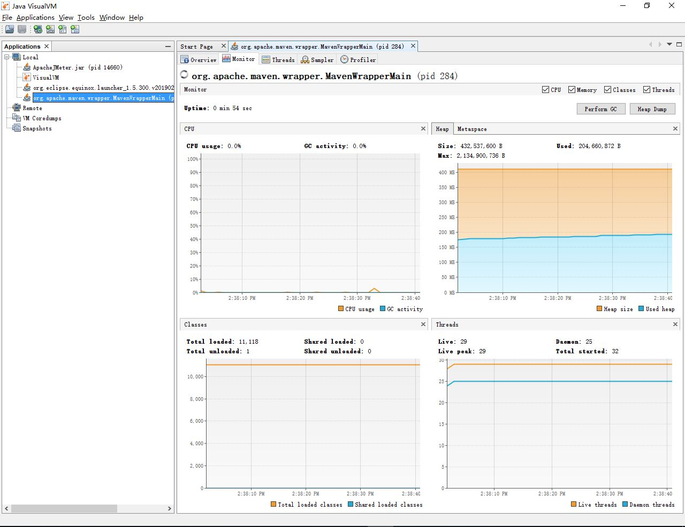

Java VisualVM是jdk自带的一个资源监控工具，从中我们可以看到CPU占用、Java虚拟机堆的大小、Java加载类的数量以及应用的线程数。

由于我是将所有的单词全部读进内存，所以一开始Java堆的大小就比较大，占用了超过200M的内存。

CPU的占用相对较低，因为这个时候应用无需处理任何请求。

### Prometheus 工具

#### 应用状态

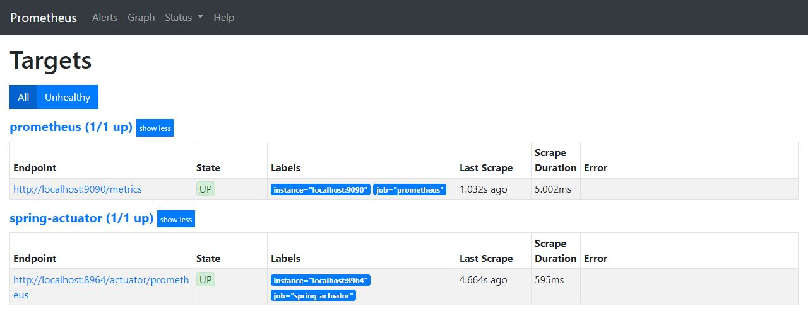

#### 内存
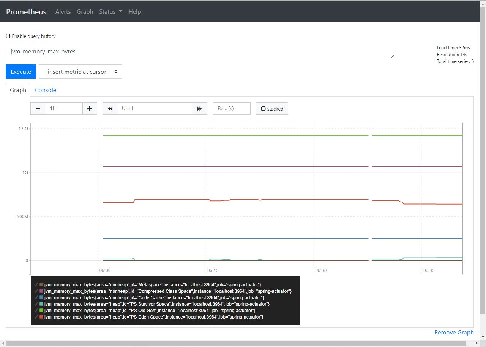

Prometheus提供了更细致的内存使用统计，比如它分了heap和non-heap多个area，每个area又都有几个id分开统计jvm的内存大小。不过这个涉及到了Java虚拟机里面的一些概念，我在此没有再去深究。

#### CPU
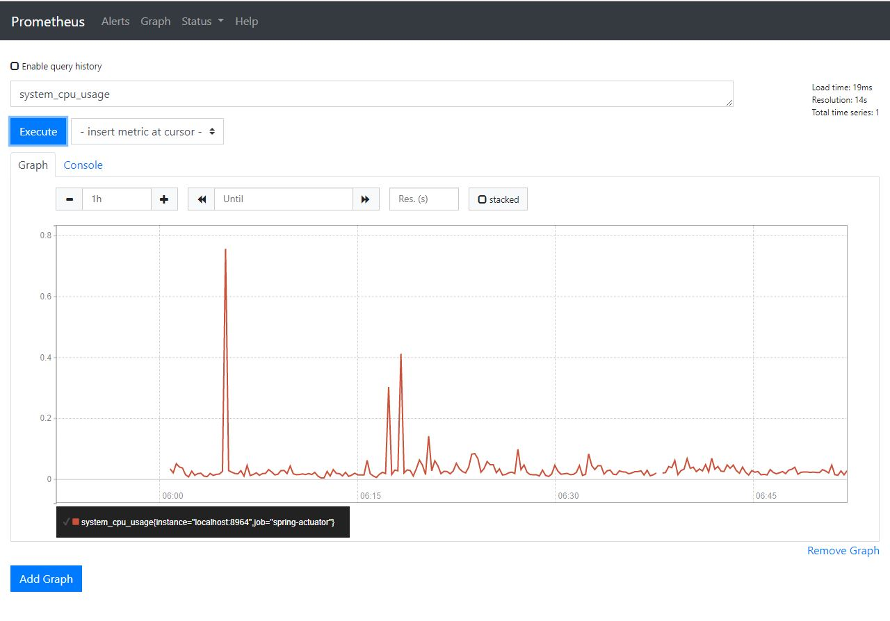

CPU在空载时的使用率一直不高。

## 应用在有压力的情况下的资源消耗情况

### JMeter 压力测试工具

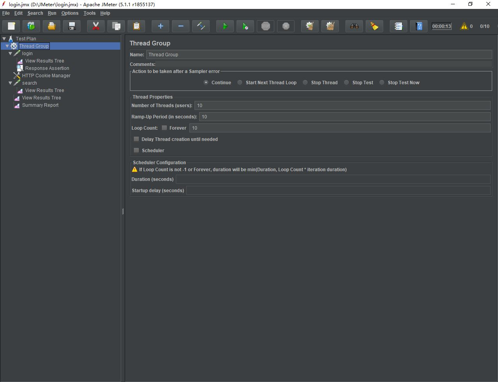

压力测试我采用了JMeter来进行，测试了login和search的接口。

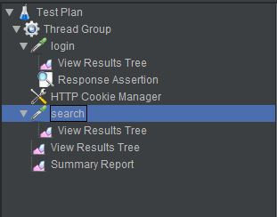

参数如下

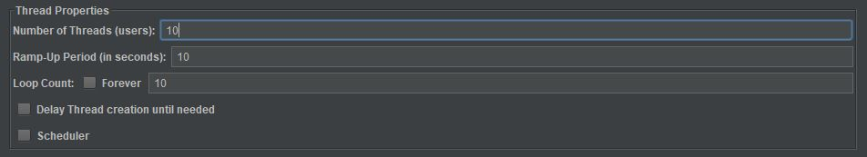

在这个参数设置下，压力测试的持续时间大概在15秒左右。

### Java VisualVM

#### 测试结束时
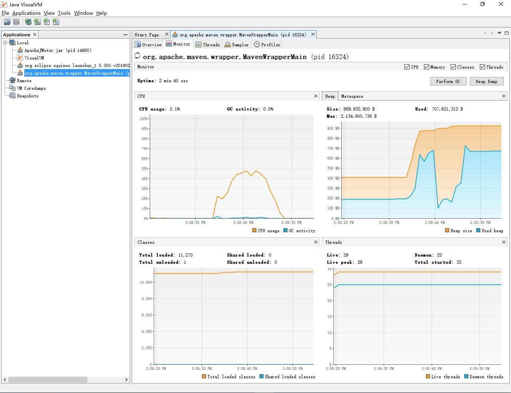

#### 测试结束一段时间后
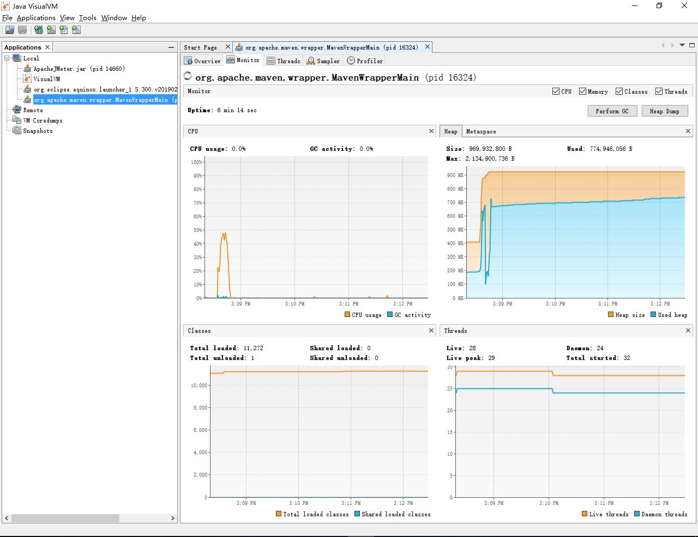

从CPU的使用率图表中可以看出，处理器峰值利用率是低于50%的。

从内存的那张图表可以看出，应用并不会马上进行GC操作，理论上应该是到了某个阈值的时候Java虚拟机才会触发GC操作来回收内存。当然用户也可以直接点上面的Perform GC按钮来直接触发这个操作。

### Prometheus

#### 内存
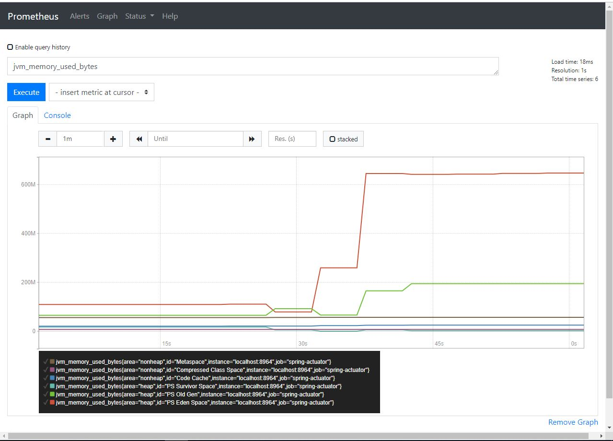

#### CPU
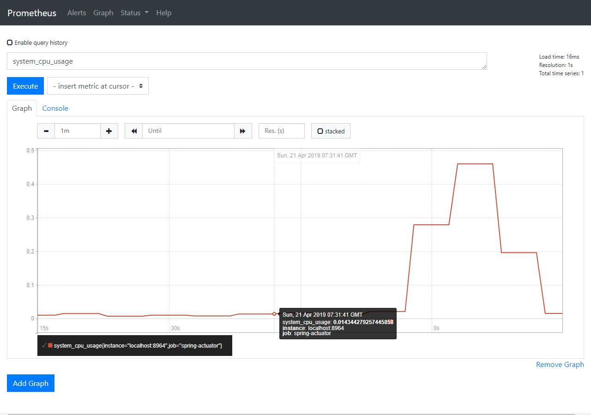

内存、CPU使用突增的节点就是触发压力测试的那个时间点。

## 增大对应用的压力

### JMeter参数
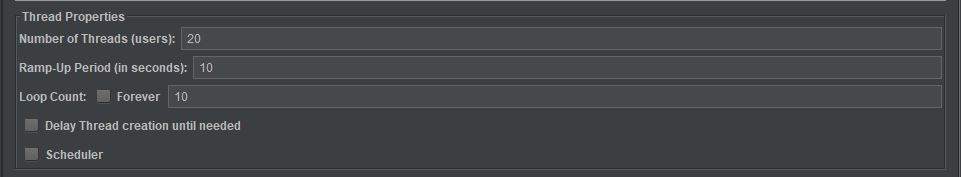
其中线程数由10增加到了20.

### Java VisualVM
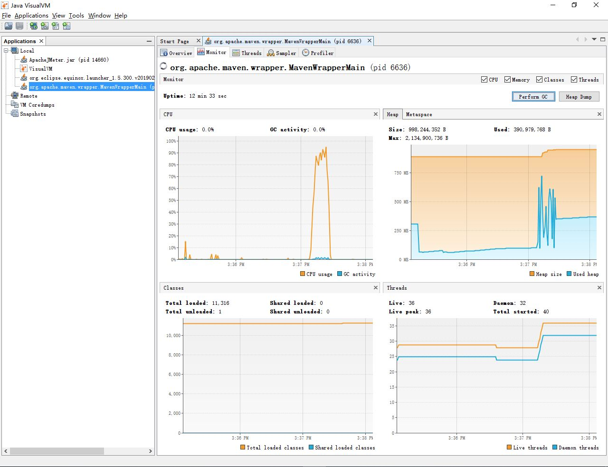
由此可见，当并发数变大之后，应用更好地利用了这个六核十二线程的CPU，CPU的峰值利用率由原来的不到50%上升到了超过90%，接近满载状态。同时总的压力测试持续时间仍然保持在15秒左右。