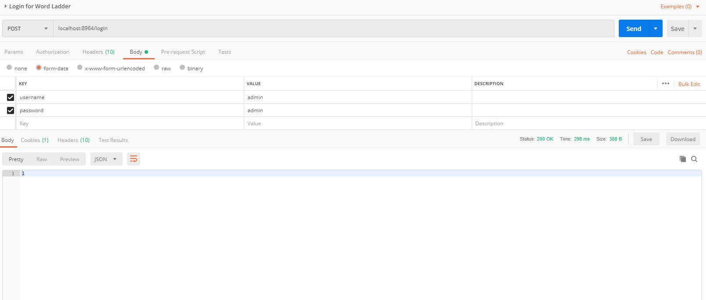
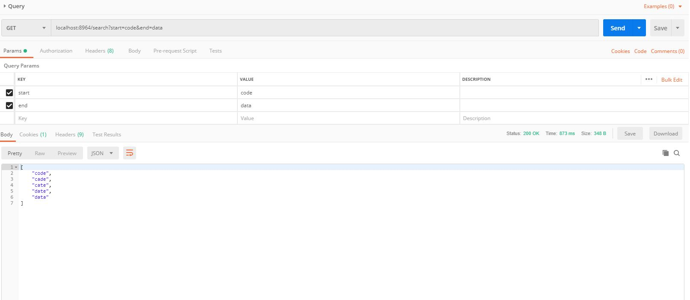

# Spring Boot 应用容器化

## Dockerfile
```
FROM openjdk:8
EXPOSE 8964
COPY ./WordLadder-0.0.1-SNAPSHOT.jar /home/wordladder.jar
ENTRYPOINT [ "java", "-jar", "/home/wordladder.jar" ]
```
其中 WordLadder-0.0.1-SNAPSHOT.jar 需要和Dockerfile放在同一目录下，jar文件可在[***Release***](https://github.com/wangtianxia-sjtu/SE418-Homework/releases)里面下载。

## 建立镜像

``` bash
docker build -t spring-boot-word-ladder:v1.1 .
```

## 镜像实例化成容器

``` bash
docker run -d -p 8964:8964 --name simple-word-ladder spring-boot-word-ladder:v1.1
```

-d 指定容器在后台运行，--name后面可以指定容器的名字，如果不指定的话docker会以科学家（比如liskov）的名字自动帮你命名。-p 将宿主机的8964端口映射到了容器的8964端口。即：

-p (host machine)8964:(container)8964

## Rest API

跑起来之后就可以访问localhost上的API了。比如

登录


搜索


可以直接配合Homework2里面的前端使用。

## 上传到 DockerHub

``` bash
docker login
(Input your username and password)
docker tag spring-boot-word-ladder:v1.1 wangtianxia/spring-boot-word-ladder:v1.1
docker push wangtianxia/spring-boot-word-ladder:v1.1
```

先把镜像tag成DockerHub的Repo的名字，然后再push上去。当然，之前先要登录。

## 从 DockerHub 拉取镜像直接启动

``` bash
docker run -d -p 8964:8964 --name wordladder wangtianxia/spring-boot-word-ladder:v1.1
```

去 [DockerHub Repository](https://cloud.docker.com/repository/docker/wangtianxia/spring-boot-word-ladder) 看看。